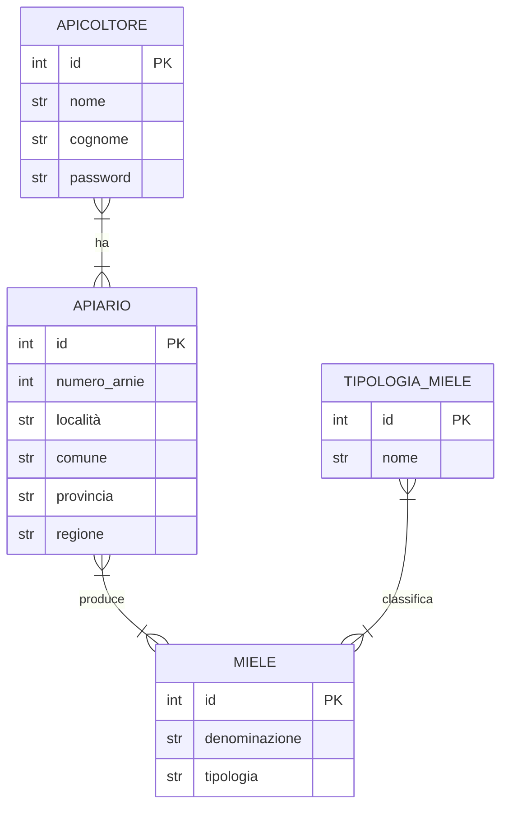

```mermaid
erDiagram

    TIPOLOGIA_MIELE {
        int id PK
        str nome 
    }

    MIELE {
        int id PK
        str denominazione
        str tipologia
    }

    APICOLTORE {
        int id PK
        str nome
        str cognome
        str password
    }

    APIARIO {
        int id PK
        int numero_arnie
        str località
        str comune
        str provincia
        str regione
    }

APIARIO }|--|{  MIELE : produce
APICOLTORE }|--|{ APIARIO : ha
TIPOLOGIA_MIELE }|--|{ MIELE : classifica

```