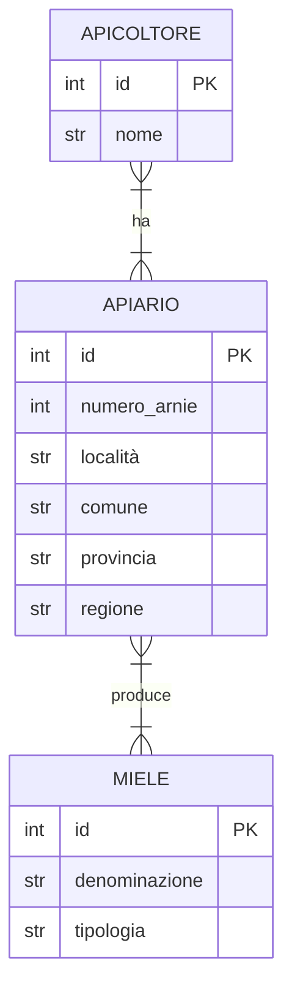

```mermaid
erDiagram
    MIELE {
        int id PK
        str denominazione
        str tipologia
    }

    APICOLTORE {
        int id PK
        str nome
    }

    APIARIO {
        int id PK
        int numero_arnie
        str località
        str comune
        str provincia
        str regione
    }

APIARIO }|--|{ MIELE : produce
APICOLTORE }|--|{ APIARIO : ha

```