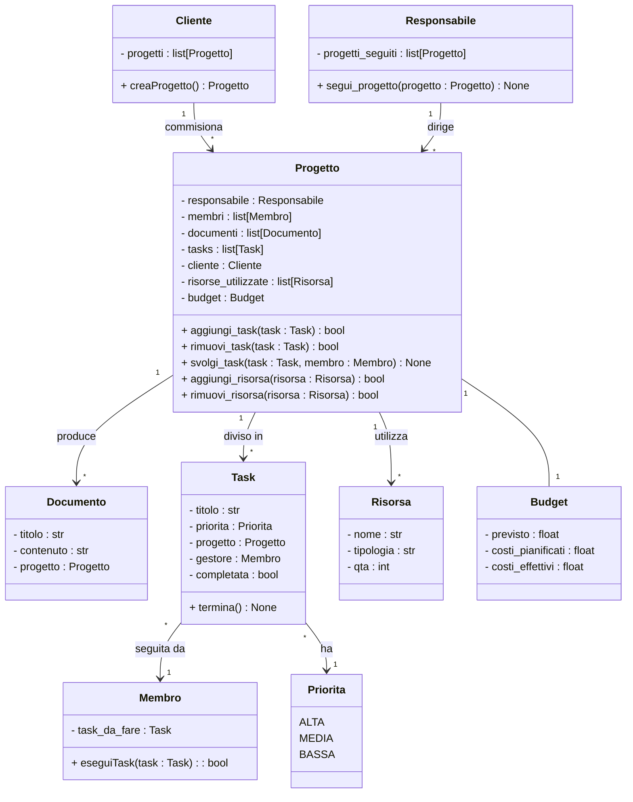

```mermaid
classDiagram
	class Progetto {
		- responsabile : Responsabile
		- membri : list[Membro]
		- documenti : list[Documento]
		- tasks : list[Task]
		- cliente : Cliente
		- risorse_utilizzate : list[Risorsa]
		- budget : Budget
		+ aggiungi_task(task : Task) bool
		+ rimuovi_task(task : Task) bool
		+ svolgi_task(task : Task, membro : Membro) None
		+ aggiungi_risorsa(risorsa : Risorsa) bool
		+ rimuovi_risorsa(risorsa : Risorsa) bool
	}

	class Responsabile {
		- progetti_seguiti : list[Progetto]
		+ segui_progetto(progetto : Progetto) None
	}

	class Membro {
		- task_da_fare : Task
		+ eseguiTask(task : Task) : bool
	}

	class Cliente {
		- progetti : list[Progetto]
		+ creaProgetto() Progetto
	}

	class Documento {
		- titolo : str
		- contenuto : str
		- progetto : Progetto
	}

	class Task {
		- titolo : str
		- priorita : Priorita
		- progetto : Progetto
		- gestore : Membro
		- completata : bool
		+ termina() None
	}
	
	class Risorsa {
		- nome : str
		- tipologia : str
		- qta : int
	}

	class Budget {
		- previsto : float
		- costi_pianificati : float
		- costi_effettivi : float
	}

	class Priorita {
		ALTA
		MEDIA
		BASSA
	}

	Cliente "1" --> "*" Progetto : commisiona
	Responsabile "1" --> "*" Progetto : dirige
	Progetto "1" --> "*" Task : diviso in
	Task "*" --> "1" Membro : seguita da
	Progetto "1" --> "*" Documento : produce
	Task "*" --> "1" Priorita : ha
	Progetto "1" --> "*" Risorsa : utilizza
	Progetto "1" -- "1" Budget
```